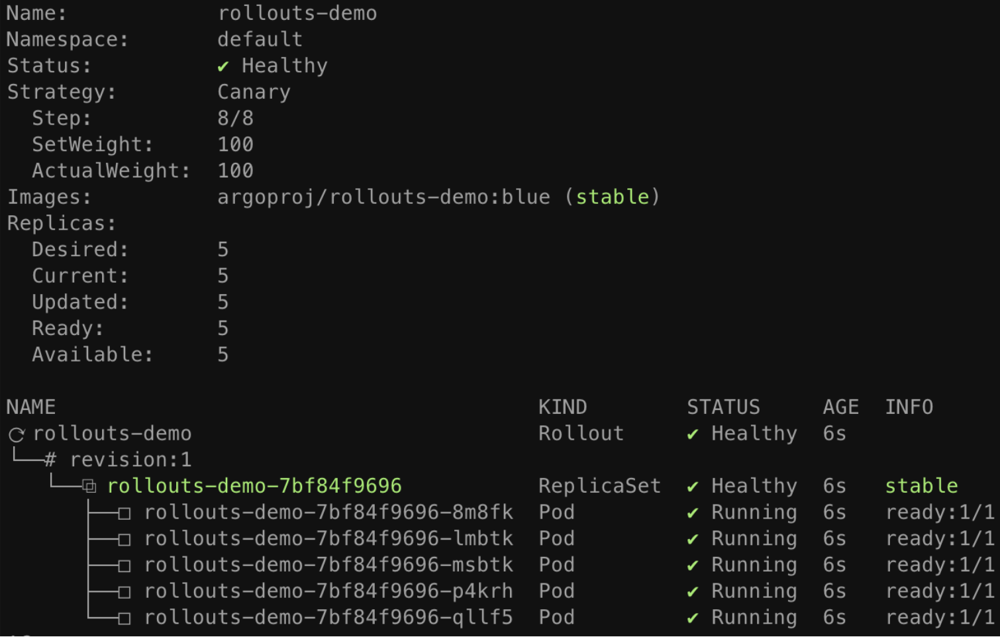
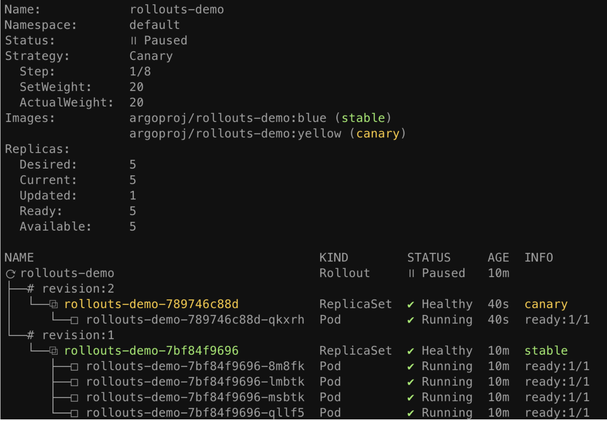
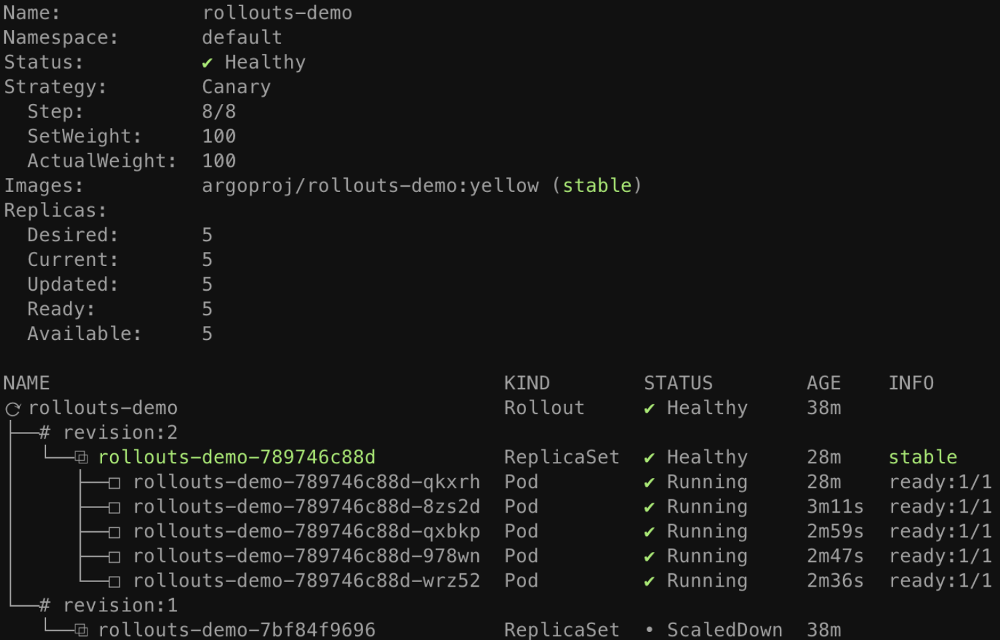
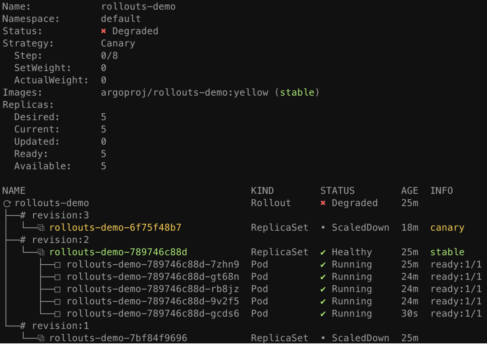
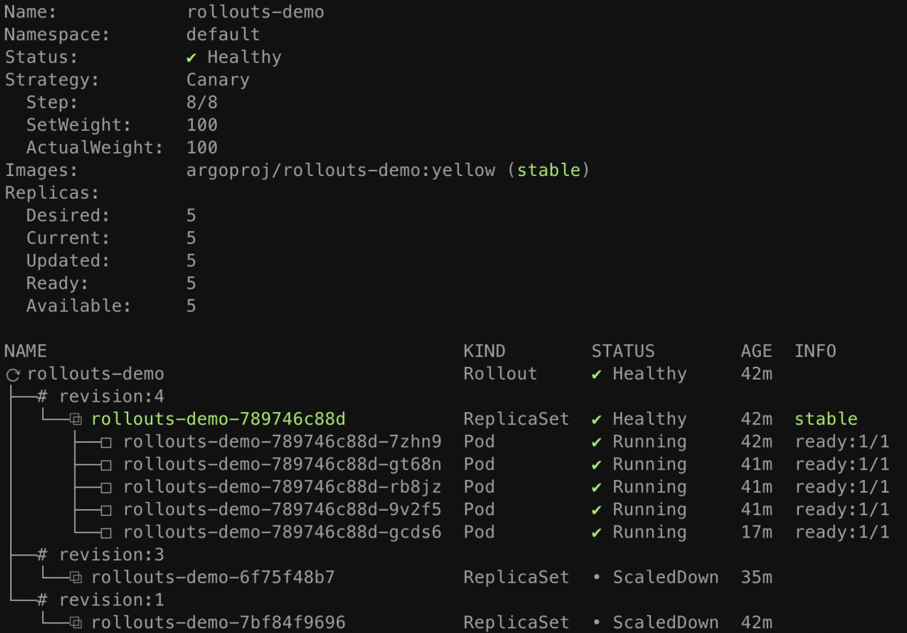

# Argo Rollout with Canary

This guide will demonstrate various concepts and features of Argo Rollouts by going through deployment, upgrade, promotion, and abortion of a Rollout.

# Requirements:

- Kubernetes cluster with argo-rollouts controller installed (see [install guideline](https://argo-rollouts.readthedocs.io/en/stable/installation/#controller-installation))

- kubectl with argo-rollouts plugin installed (see [install guideline](https://argo-rollouts.readthedocs.io/en/stable/installation/#kubectl-plugin-installation))

# 1. Deploying a Rollout

- A canary update stategy which sends 20% of traffic to canary, followed by a manual promotion, and finally gradual automated traffic increases for the remainder of the upgrade.

```yaml
spec:
  replicas: 5
  strategy:
    canary:
      steps:
      - setWeight: 20
      - pause: {}
      - setWeight: 40
      - pause: {duration: 10}
      - setWeight: 60
      - pause: {duration: 10}
      - setWeight: 80
      - pause: {duration: 10}
```

Run the following command to deploy the initial Rollout and Service:

```bash
kubectl apply -f https://raw.githubusercontent.com/argoproj/argo-rollouts/master/docs/getting-started/basic/rollout.yaml
kubectl apply -f https://raw.githubusercontent.com/argoproj/argo-rollouts/master/docs/getting-started/basic/service.yaml
```

The Argo Rollouts kubectl plugin allows you to visualize the Rollout, its related resources (ReplicaSets, Pods, AnalysisRuns), and presents live state changes as they occur. To watch the rollout as it deploys, run the `get rollout --watch` command from plugin:

```bash
kubectl argo rollouts get rollout rollouts-demo --watch
```


# 2. Updating a Rollout

It is time to perform an update. Just as with Deployments, any change to the Pod template field (`spec.template`) results in a new version (i.e. ReplicaSet) to be deployed. Updating a Rollout involves modifying the rollout spec, typically changing the container image field with a new version, and then running `kubectl apply` against the new manifest. As a convenience, the rollouts plugin provides a set image command, which performs these steps against the live rollout object in-place. Run the following command to update the `rollouts-demo` Rollout with the "yellow" version of the container:

```bash
kubectl argo rollouts set image rollouts-demo \
  rollouts-demo=argoproj/rollouts-demo:yellow
```

During a rollout update, the controller will progress through the steps defined in the Rollout's update strategy. The example rollout sets a 20% traffic weight to the canary, and pauses the rollout indefinitely until user action is taken to unpause/promote the rollout. After updating the image, watch the rollout again until it reaches the paused state:

```bash
kubectl argo rollouts get rollout rollouts-demo --watch
```



When the demo rollout reaches the second step, we can see from the plugin that the Rollout is in a paused state, and now has 1 of 5 replicas running the new version of the pod template, and 4 of 5 replicas running the old version. This equates to the 20% canary weight as defined by the `setWeight: 20` step.

# 3. Promoting a Rollout

The rollout is now in a paused state. When a Rollout reaches a `pause` step with no duration, it will remain in a paused state indefinitely until it is resumed/promoted. To manually promote a rollout to the next step, run the `promote` command of the plugin:

```bash
kubectl argo rollouts promote rollouts-demo
```

After promotion, Rollout will proceed to execute the remaining steps. The remaining rollout steps in our example are fully automated, so the Rollout will eventually complete steps until it has has fully transitioned to the new version. Watch the rollout again until it has completed all steps:

```bash
kubectl argo rollouts get rollout rollouts-demo --watch
```



> The `promote` command also supports the ability to skip all remaining steps and analysis with the `--full` flag.

Once all steps complete successfully, the new ReplicaSet is marked as the "stable" ReplicaSet. Whenever a rollout is aborted during an update, either automatically via a failed canary analysis, or manually by a user, the Rollout will fall back to the "stable" version.

# 4. Aborting a Rollout

First, deploy a new "red" version of the container using the `set image` command, and wait for the rollout to reach the paused step again:

```bash
kubectl argo rollouts set image rollouts-demo \
  rollouts-demo=argoproj/rollouts-demo:red
```

This time, instead of promoting the rollout to the next step, we will abort the update, so that it falls back to the "stable" version. The plugin provides an `abort` command as a way to manually abort a rollout at any time during an update:

```bash
kubectl argo rollouts abort rollouts-demo
```

When a rollout is aborted, it will scale up the "stable" version of the ReplicaSet (in this case the yellow image), and scale down any other versions. Although the stable version of the ReplicaSet may be running and is healthy, the overall rollout is still considered `Degraded`, since the desired version (the red image) is not the version which is actually running.



In order to make Rollout considered Healthy again and not Degraded, it is necessary to change the desired state back to the previous, stable version. This typically involves running `kubectl apply` against the previous Rollout spec. In our case, we can simply re-run the `set image` command using the previous, "yellow" image.

```bash
kubectl argo rollouts set image rollouts-demo \
  rollouts-demo=argoproj/rollouts-demo:yellow
```

After running this command, you should notice that the Rollout immediately becomes Healthy, and there is no activity with regards to new ReplicaSets becoming created.



When a Rollout has not yet reached its desired state (e.g. it was aborted, or in the middle of an update), and the stable manifest were re-applied, the Rollout detects this as a rollback and not a update, and will fast-track the deployment of the stable ReplicaSet by skipping analysis, and the steps.

# References:

1. https://argo-rollouts.readthedocs.io/en/stable/getting-started/