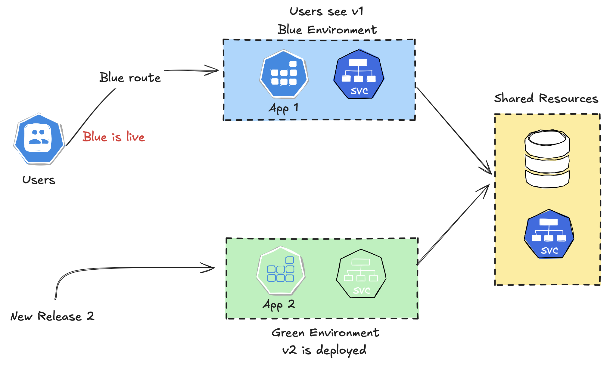
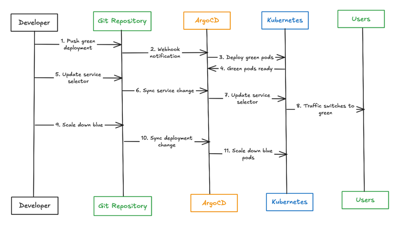

# BLUE/GREEN DEPLOYMENT

## What are blue/green deployments?

A blue/green deployment is a software release management strategy that minimizes downtime and reduces risk by running 2 identical production environments, referred to as “blue” (production) and “green” (new version). Only one of these environments serves live production traffic at any time, while the other remains idle. Blue/green deployments let you deploy updates and new features with minimal disruption and maximum reliability.

In a typical blue/green deployment setup, the blue environment is the active environment serving users. When a new application version is ready, you deploy it to the green environment, which mirrors the blue environment but doesn’t handle live traffic yet.

## Benefits of blue/green deployments

Blue/green deployments reduce the risk of downtime during deployments. They’re also a powerful way to use hardware that was traditionally used for staging environments. A blue/green setup serves 3 purposes:

- __Staging__: When blue is activce, green becomes the staging environment for the next deployment.
- __Rollback__: After deploying to blue and making it active, you discover a problem. Since green still runs the old code,
you can roll back easily.
- __Disaster recovery__: After deploying to blue and being satisfied that it's stable, you can deploy the new release to green, too.
This gives you a standby environment ready in case of disaster.

Blue/green deployments are especially useful for:

- __Zero-downtime releases__: Organizations that require high availability can use blue/green deployment to release new features without downtime.
- __Performance benchmarking__: Organizations can use the idle environment to run performance tests on the new version without affecting the live
environment. This helps fine-tune and optimize the application before it goes live.
- __Compliance and audits__: In regulated industries, maintaining a robust deployment strategy is essential. Blue/green deployments ensure that changes are transparent and reversible, smoothing compliance audits.

## How does blue/green deployment work?

The blue/green deployment process involves several steps:

1. __Prepare the new release__: Develop and test the new version of the application in a staging environment.
2. __Deploy the green environment__: Deploy the new application version to the green environment, which is a clone
of the blue environment but not yet live.
3. __Testing__: You can test the new version on the green environment to ensure it functions as expected without affecting
the user experience.
4. __Switch traffic__: Redirect user traffic from the blue environment to the green environment. You can do this using a load balancer or 
DNS switch.
5. __Monitor__: Closely monitor the green environment for any issues or anomalies after it goes live.
6. __Fallback plan__: If there are any critical issues, you can quickly switch traffic back to the blue environment, ensuring
minimal disruption.
7. __Cleanup__: After the green environment is stable and running without issues, you can update the blue environment with
the same changes, keep it as a backup for the next deployment cycle, or phase it out to reduce costs.

## Blue/green deployment and Kubernetes

Kubernetes, an open-source container orchestration platform, simplifies the implementation of blue/green deployments. In a Kubernetes environment, you can manage blue/green deployments using several Kubernetes resources and tools:

1. __Namespaces__: Use namespaces to separate the blue and green environments, ensuring isolation and organization.
2. __Deployments__: Kubernetes deployments manage the rollout of the new application version to the green environment. Each deployment can have separate configurations and resource allocations.
3. __Services__: Kubernetes services direct traffic to the appropriate environment. You can update a service to point to the green environment after the deployment is successful and tested.
4. __Ingress controllers__: Ingress controllers handle external traffic routing, allowing seamless traffic switching between blue and green environments based on the ingress rules. Alternatively, external load balancers or a service mesh can handle traffic routing in a blue/green setup.
5. __Monitoring and logging tools__: Use Kubernetes-specific monitoring and logging tools like Prometheus and Grafana to monitor the the green environment’s performance after the switch.

## Blue/green deployment pros and cons

Blue/green deployments offer several key benefits that improve software release processes:

1. __Less downtime__: By switching traffic between identical environments, blue/green deployments ensure that users experience minimal or no downtime during updates. This is crucial for businesses requiring high availability.
2. __Immediate rollback__: In case of a problem with the new release, you can quickly redirect traffic back to the stable environment. This significantly reduces the risk of prolonged outages and ensures business continuity.
3. __Simpler testing__: The green environment provides a complete and isolated setup for testing the new version under real-world conditions, without impacting the live user base.
4. __Improved deployment confidence__: Knowing that a rollback is quick and easy, development and operations teams can deploy new features and updates with greater confidence.
5. __Better user experience__: By ensuring new releases don’t disrupt service, blue/green deployments contribute to a better user experience.
6. __Supports compliance__: For industries with strict regulatory requirements, blue/green deployments offer a clear, auditable deployment process. Changes get tracked, and you can quickly revert to a previous state which helps meet compliance standards.

Despite the advantages, blue/green deployments come with several challenges that organizations must address:

1. __Resource overhead__: Maintaining 2 identical environments requires more resources, which can be costly. This includes infrastructure and the effort to keep both environments synchronized and up-to-date.
2. __Complexity in database changes__: If the new release involves significant database schema changes, ensuring compatibility between the blue and green environments can be complex. You need to carefully plan data synchronization and migration strategies to avoid inconsistencies.
3. __Load balancer configuration__: Properly configuring load balancers or DNS settings to switch traffic between environments can be technically challenging. Any errors in configuration can lead to partial traffic routing or downtime.
4. __Monitoring and testing rigor__: You need to comprehensively monitor and test the green environment to find issues before switching traffic. This requires robust monitoring tools and a well-defined testing strategy.
5. __Security considerations__: Running 2 environments simultaneously increases the attack surface. Ensuring both environments are compliant with security policies adds to the operational burden.
6. __Automation requirements__: To effectively manage blue/green deployments, organizations need to invest in automation tools and processes. Manual handling of deployments increases the risk of human error and negates many of the benefits.

## Workflow

## References:
1. [Blue/Green Deployment](https://octopus.com/devops/software-deployments/blue-green-deployment/)