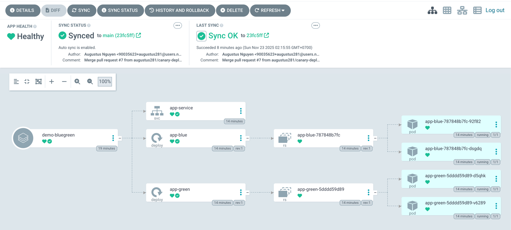

# Blue/Green Deployment

This directory demonstrates the Blue/Green deployment strategy.

## How It Works
- Both Blue and Green environments run the same app versioned differently.
- The Service routes traffic to only one color at a time.
- Switching is done by updating the Service selector (color: blue/color: green).
- ArgoCD manages deployments automatically from Git.

## Prerequisites

- Kubernetes cluster with kubectl configured
- ArgoCD installed and running

## Steps

### 1️⃣ Create Namespace

```bash
kubectl create namespace demo
```
Or use Argo CD Application `createNamespace`: true to auto-create.

### 2️⃣ Deploy Blue-Green via Argo CD

1.	Apply the Argo CD Application manifest:

```bash
kubectl apply -f k8s/argocd/apps/demo-bluegreen.yaml -n argocd
```

2. Sync the application:

```bash
argocd app sync demo-bluegreen
```

3. Check status

```bash
argocd app get demo-bluegreen
kubectl get deploy -n demo -l app=demo
kubectl get pods -n demo -l app=demo
kubectl get svc -n demo
```


### 3️⃣ Verify Current Active Color

```bash
kubectl get svc app-service -n demo -o yaml | grep color
```
- Shows whether traffic currently goes to blue or green.

### 4️⃣ Switch Traffic (Blue → Green)

```bash
kubectl patch svc app-service -n demo -p '{"spec":{"selector":{"app":"demo","color":"green"}}}'
```
Verify:

```bash
kubectl get pods -n demo -l color=green
curl http://<service-ip-or-port-forward>
```

### 5️⃣ Optional: Rollback (Green → Blue)

```bash
kubectl patch svc app-service -n demo -p '{"spec":{"selector":{"app":"demo","color":"blue"}}}'
```